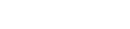

## Формулы линейной регрессии

Коэффициент наклона (β):  

Свободный член (α):  

Предсказанное значение Y:  

Пример (x): 2, 53, 45, 44, 46, 43, 46, 46, 45, 48, 45, 50, 49, 46, 45, 45, 46, 47, 44, 45, 48, 46, 45, 45, 51, 52, 52, 52, 51, 54, 51, 50, 49, 52, 48, 48, 47, 50, 49, 50, 51, 51, 53, 54, 54, 54, 55, 54, 50, 50, 36, 38, 39, 31, 34, 28, 32, 36, 36, 38, 37, 34, 38, 34, 38, 38, 39, 35, 36, 36, 37, 48, 35, 39, 37, 36, 42, 38, 35, 34, 35, 33, 34, 33, 48, 35, 40, 47, 49, 40, 43, 46, 46, 47, 48, 45

Пример (y): 75,78,81,78,76,76,70,77,81,84,84,79,74,75,76,67,80,82,82,84,78,77,77,76,84,82,82,81,83,88,85,79,86,85,85,84,84,75,74,79,79,81,83,88,88,87,88,89,81,81,68,68,70,62,60,58,62,64,64,61,56,56,65,73,77,70,72,66,65,60,70,78,64,67,72,69,70,78,64,64,61,62,62,51,85,66,70,71,77,76,77,76,77,78,78,62
